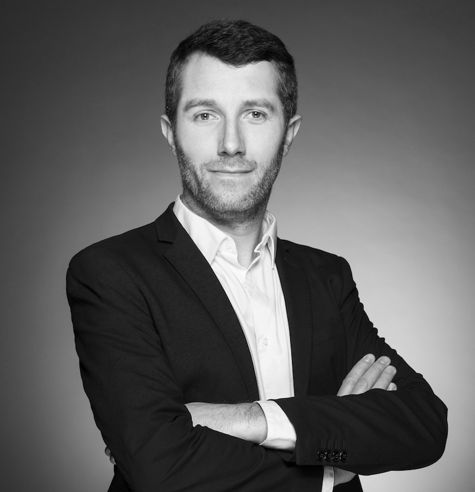
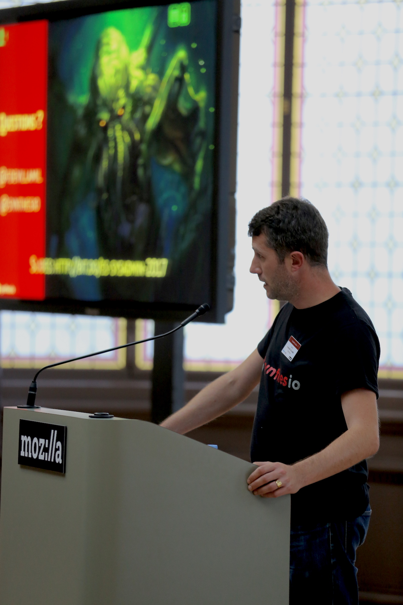

# Fred de Villamil

## Biography

Fred is French, lives in Paris and is CTO at Myli, a small startup located in the south of France.

Fred has significant experience in the Digital industry, building and scaling up teams and infrastructures for various B2B big data startups.

Prior to joining Myli, Fred was VP Engineering at Ledger and Aircall, created ELive, the first streaming service in the e-sport world, and Niten, an agile development studio for startups. He directed the Infrastructure departments of blueKiwi Software, the first Enterprise Social Network (acquired by Atos in 2011), and Synthesio, the European leading solution in Marketing Analytics.

A 20 years Open Source contributor, Fred is also a Speaker in Tech and Big Data events where he talks about scaling engineering teams and infrastructures and acts as Technical Advisor for several startups in the French ecosystem.

## Find me online

* Github: [fdv](https://github.com/fdv)
* Twitter: [fdevillamil](https://twitter.com/fdevillamil)
* Linkedin: [fdevillamil](https://linkedin.com/in/fdevillamil)

## Author

* [Running Elasticsearch for Fun and Profit](https://github.com/fdv/running-elasticsearch-fun-profit)
